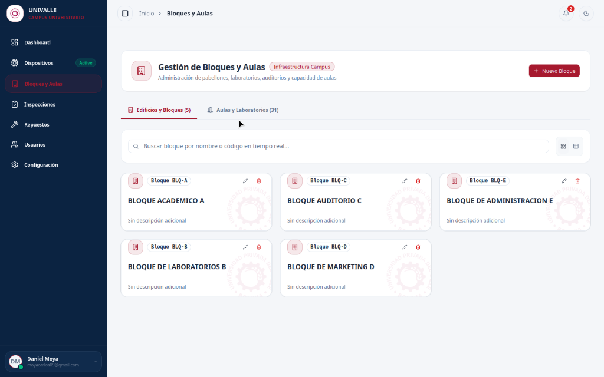
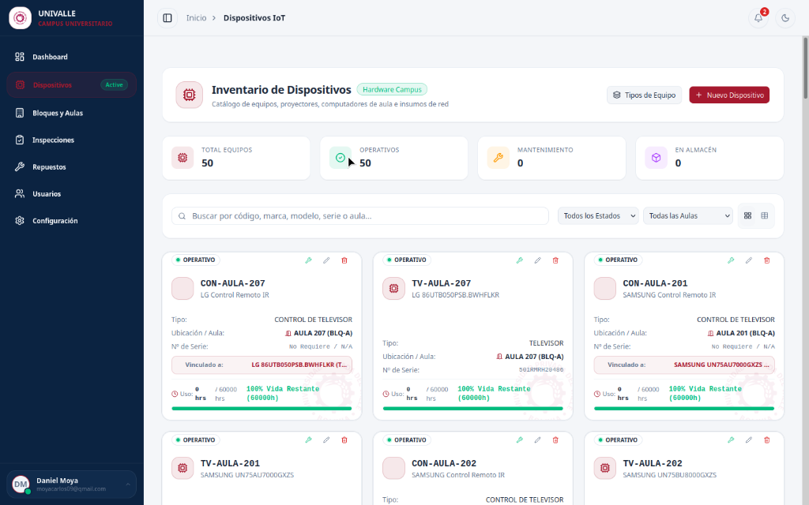

# 🎓 UNIVALLE Campus Devices
### Sistema de Gestión de Infraestructura & Dispositivos IoT (Universidad Privada del Valle)

[](https://angular.dev/)
[](https://tailwindcss.com/)
[](https://supabase.com/)
[](https://www.typescriptlang.org/)
[](LICENSE)

Plataforma web avanzada desarrollada para la **Universidad Privada del Valle (UNIVALLE)** orientada al control, auditoría en tiempo real, gestión de vida útil y mantenimiento preventivo de la infraestructura tecnológica y dispositivos IoT desplegados en todas las aulas y bloques del campus universitario.

---

## 📸 Capturas del Sistema (Screenshots)

<div align="center">
  
  <p><em>Dashboard Ejecutivo en Tiempo Real con Gráficos Interactivos SVG, KPIs de Salud de Campus y Acceso Rápido</em></p>
  <br/>
  
  <p><em>Inventario Inteligente de Dispositivos con Marcas de Agua Institucionales, Filtros y Emparejamiento TV-Control</em></p>
</div>

---

## 🚀 Características Clave

### 📊 1. Dashboard Ejecutivo & Analytics
- **KPIs Estratégicos:** Total de Equipos Activos, Tasa de Disponibilidad del Campus (%), Presupuesto Invertido en Repuestos y Rondines Activos.
- **Gráficos SVG Interactivos:** Donut Chart de estado operativo, Ring Gauge de salud/vida útil del campus y Barras Comparativas de disponibilidad por Bloque.
- **Acciones Rápidas (Quick Actions Bar):** Botones directos `[+ Ronda]`, `[+ Equipo]`, `[+ Repuesto]` e `[Informe]` para aperturar formularios desde la pantalla principal.

### 💻 2. Inventario Inteligente de Dispositivos (IoT Hardware)
- **Asociación Dinámica TV - Control Remoto:** Emparejamiento por aula sin duplicidad de números de serie.
- **Formulario Adaptativo:** Medición de horas de uso (60,000 hrs de vida útil por defecto para TVs), marcas de agua sutiles de UNIVALLE con micro-interacciones hover.
- **Badge de Antigüedad:** Cálculo automático del tiempo de permanencia del equipo en el campus (*ej: 6 m. en campus*).

### 🏢 3. Edificios, Bloques y Aulas
- **Control por Pisos / Niveles:** Filtro rápido por nivel (*Planta Baja, Piso 1 al 5, Subsuelo*).
- **Métricas Asignadas:** Conteo en tiempo real de aulas y equipos asignados a cada bloque.

### 📋 4. Rondines e Inspecciones Técnicas
- **Checklist Adaptativo por Categoría:**
  - **Control Remoto:** Tipo de alimentación (*Pilas AAA, AA, Carga Solar*), estado de batería (*🔋 100%, 50%, Requiere Cambio*), emisor IR/BT y carcasa. Oculta automáticamente cables HDMI/Poder.
  - **Televisores:** Enciende OK, Cables (Poder/HDMI), Estado de panel/pantalla y Horas de uso leídas en la TV.
  - **Proyectores:** Proyección/Foco, Filtro de Aire, Cables y Horas de Lámpara.
- **Barra de Progreso de Auditoría (%):** Indicador animado del avance de aulas inspeccionadas por cada ronda en curso.

### 🔧 5. Repuestos & Mantenimiento Preventivo
- Registro de insumos cambiados (*Cables HDMI/Poder, Pilas, Lámparas, Controles Remotos*), técnico responsable, costo en USD y aula impactada.
- Resumen automático de presupuesto acumulado.

### 🛡️ 6. Control de Acceso Basado en Roles (RBAC)
- **Administrador:** Acceso total a creación, edición y eliminación de infraestructura, usuarios y repuestos.
- **Soporte Técnico:** Gestión operativa de inspecciones, checklists y sustitución de repuestos.
- **Visualizador:** Acceso exclusivo de solo lectura a métricas y reportes.

---

## 🛠️ Stack Tecnológico

- **Frontend:** Angular 19 (Standalone Components, Signals, `linkedSignal`, `httpResource`, Control Flow `@if`/`@for`).
- **Estilos & UI:** TailwindCSS v4 + Zard UI (Sheets, Drawers, Cards, Badges, Inputs, Tables).
- **Iconografía:** NgIcons Lucide.
- **Base de Datos & Backend:** Supabase (PostgreSQL, Realtime APIs).
- **Despliegue & CI/CD:** Netlify + GitHub Actions.

---

## 💻 Instalación y Uso Local

```bash
# 1. Clonar el repositorio
git clone https://github.com/danielmoya98/angular-devices.git
cd angular-devices

# 2. Instalar dependencias
npm install

# 3. Iniciar el servidor de desarrollo
npm run dev

# 4. Abrir en el navegador
# http://localhost:4200
```

---

## 🔄 Integración Continua (CI/CD)

El proyecto cuenta con un flujo automatizado en **GitHub Actions** (`.github/workflows/deploy.yml`) que compila la aplicación Angular e implementa automáticamente cualquier cambio pusheado a la rama `master` en la plataforma de producción de **Netlify**.

---

## 📄 Licencia

Este proyecto ha sido desarrollado para fines institucionales en la **Universidad Privada del Valle (UNIVALLE)**. Todos los derechos reservados.
